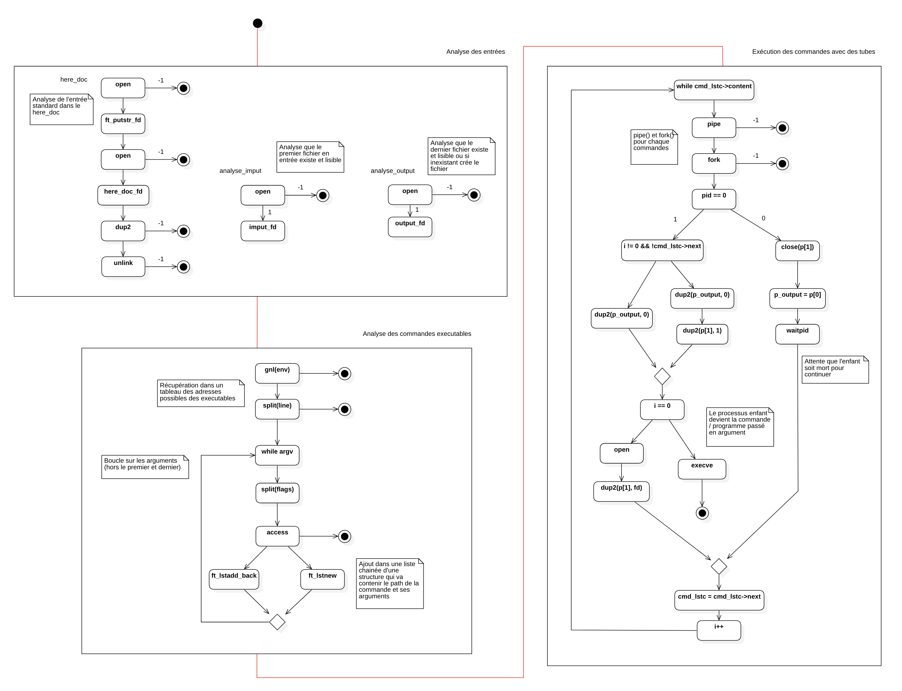
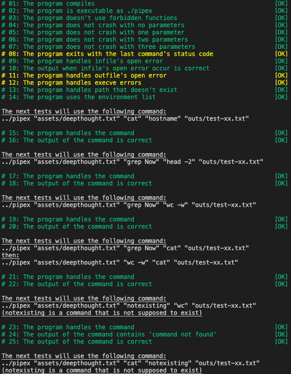
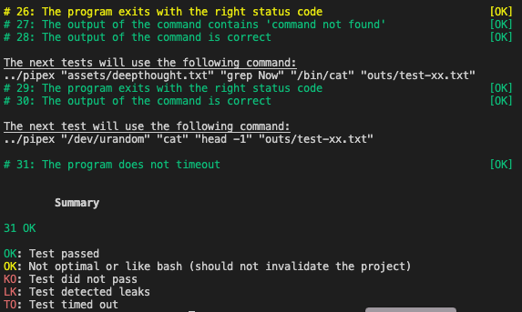
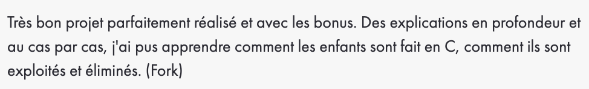

# Pipex

Quatrième projet de [42](https://42.fr/) dont le but est de recréer un système similaire aux pipes de Bash.

---

### Compilation :

Pour compiler le projet, exécutez la commande suivante :

```
make
```

### Utilisation :

Le programme doit s'exécuter de la façon suivante : 

```
./pipex [input file] [cmd1] [cmd2] [output file]

./pipex_bonus [input file] [cmd1] [cmd2] [cmd3] ... [cmdn] [output file]
```


### Exemple d'utiliation :

```
./pipex input.txt cat rev output.txt

./pipex_bonus hp1.txt cat "grep Voldemort" rev  output.txt

./pipex_bonus here_doc END /bin/cat rev md5 output.txt
```

---
### Diagrammes :

| Diagramme d'activité |
| --- |
|  |

---
### Tests automatisés :

| [pipex-tester](https://github.com/vfurmane/pipex-tester) | 
| --- |
|  |
|  |

---
### Correction :

| |
| --- |
|  |

| | |
| --- | --- |
| Correcteur 1 |  |
| Correcteur 2 |  |
| Correcteur 3 |  |
